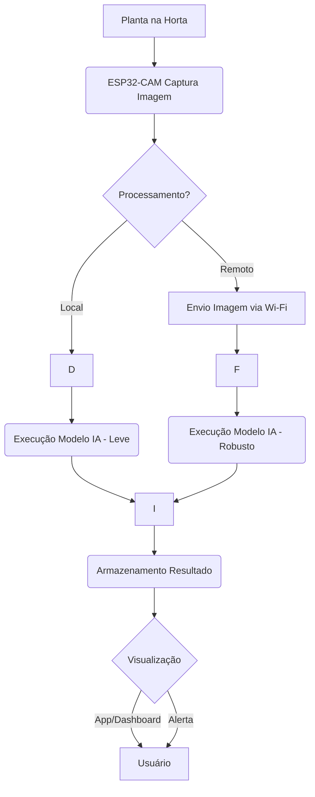

# Projeto IA para Saúde de Plantas (IA_saude_plantas)

Este projeto utiliza um ESP32-CAM para capturar imagens de plantas, processá-las usando Inteligência Artificial (simulada) para classificar sua saúde/qualidade, e exibir os resultados em um dashboard. O processamento de IA pode ocorrer localmente no ESP32-CAM (modelo leve) ou remotamente em um servidor (modelo mais robusto).


## Pesquisa e Documentação Adicional
*   [Projeto Detalhado ESP32+Horta (PDF)](Pesquisa/Projeto%20Esp32+Horta.pdf)

## Funcionalidades Principais

*   **Captura de Imagem:** O ESP32-CAM captura imagens de plantas em intervalos configuráveis.
*   **Processamento de IA Flexível:**
    *   **Local:** Execução de um modelo de IA leve (simulado) diretamente no ESP32.
    *   **Remoto:** Envio da imagem via Wi-Fi para um servidor Python/Flask que executa um modelo de IA (simulado, potencialmente mais robusto).
*   **Classificação da Qualidade:** A planta é classificada com base na análise da imagem.
*   **Armazenamento de Resultados:**
    *   Localmente no ESP32 (arquivo de log).
    *   Remotamente no servidor (arquivo JSON e imagens).
*   **Visualização:** Um dashboard web (Streamlit) permite ao usuário visualizar os resultados da classificação e as imagens capturadas.

## Arquitetura do Sistema



**Componentes Detalhados:**

*(O texto abaixo descreve os componentes numerados no diagrama de forma mais textual)*

1.  **ESP32-CAM (`c:\Users\anton\Documents\GitHub\IA_saude_plantas\esp32Code\`):**
    *   Responsável pela captura de imagens e pela decisão de onde o processamento ocorrerá.
    *   Executa MicroPython.
    *   Contém `boot.py` para conexão Wi-Fi e `main.py` para a lógica principal.
2.  **Servidor (`c:\Users\anton\Documents\GitHub\IA_saude_plantas\server_code\` - *a ser criado*):**
    *   Uma aplicação Python Flask que recebe imagens do ESP32-CAM.
    *   Executa o modelo de IA "robusto" (simulado).
    *   Armazena as imagens recebidas e os resultados da classificação.
3.  **Dashboard (`c:\Users\anton\Documents\GitHub\IA_saude_plantas\dashboard_code\` - *a ser criado*):**
    *   Uma aplicação Python Streamlit que lê os dados do servidor.
    *   Exibe os resultados da classificação, históricos e imagens.

## Estrutura de Diretórios (Planejada)

```
IA_saude_plantas/
├── esp32Code/                  # Código MicroPython para o ESP32-CAM
│   ├── boot.py
│   ├── main.py
│   ├── micropython_requirements.txt # Descrição das dependências do MicroPython
│   └── README.md                  # README específico para o código do ESP32
├── server_code/                # Código Python para o servidor Flask (a ser criado)
│   ├── server.py
│   └── data/
│       ├── images/
│       └── results.json
├── dashboard_code/             # Código Python para o dashboard Streamlit (a ser criado)
│   └── dashboard.py
├── requirements.txt            # Dependências Python para servidor e dashboard
└── README.md                   # Este arquivo (README principal do projeto)
```

## Pré-requisitos

*   Python 3.7+ (para o servidor e dashboard)
*   `pip` (Python package installer)
*   Hardware ESP32-CAM e ambiente de desenvolvimento MicroPython configurado (Thonny, esptool, etc.)

## Configuração e Instalação

### 1. Código do ESP32-CAM

*   Consulte as instruções detalhadas em `c:\Users\anton\Documents\GitHub\IA_saude_plantas\esp32Code\README.md`.
*   **Principais passos:**
    *   Configure as credenciais Wi-Fi em `c:\Users\anton\Documents\GitHub\IA_saude_plantas\esp32Code\boot.py`.
    *   Configure o modo de processamento (`PROCESSAMENTO_LOCAL`) e o IP do servidor (se remoto) em `c:\Users\anton\Documents\GitHub\IA_saude_plantas\esp32Code\main.py`.
    *   Instale a biblioteca `urequests` no MicroPython do ESP32.
    *   Transfira `boot.py` e `main.py` para o ESP32-CAM.

### 2. Servidor e Dashboard (Python no PC/Servidor)

1.  Clone este repositório (se ainda não o fez).
2.  Navegue até o diretório raiz do projeto: `cd c:\Users\anton\Documents\GitHub\IA_saude_plantas\`
3.  Crie e ative um ambiente virtual (recomendado):
    ```bash
    python -m venv venv
    # Windows
    .\venv\Scripts\activate
    # macOS/Linux
    # source venv/bin/activate
    ```
4.  Instale as dependências Python:
    ```bash
    pip install -r requirements.txt
    ```
    *(Nota: O arquivo `requirements.txt` deve conter `Flask`, `streamlit`, `pandas`)*

## Executando o Projeto

1.  **ESP32-CAM:**
    *   Após configurar e transferir os scripts, reinicie o ESP32-CAM. Ele tentará se conectar ao Wi-Fi e iniciará o `main.py`.

2.  **Servidor (se `PROCESSAMENTO_LOCAL = False` no ESP32):**
    *   Navegue até `c:\Users\anton\Documents\GitHub\IA_saude_plantas\server_code\`.
    *   Execute o servidor Flask (exemplo, o arquivo `server.py` precisa ser criado):
        ```bash
        python server.py
        ```
    *   Certifique-se de que o `SERVER_IP` em `esp32Code/main.py` corresponde ao IP da máquina que executa o servidor.

3.  **Dashboard:**
    *   Navegue até `c:\Users\anton\Documents\GitHub\IA_saude_plantas\dashboard_code\`.
    *   Execute a aplicação Streamlit (exemplo, o arquivo `dashboard.py` precisa ser criado):
        ```bash
        streamlit run dashboard.py
        ```
    *   Abra o navegador no endereço fornecido (geralmente `http://localhost:8501`).

## Próximos Passos e Melhorias

*   Implementar modelos de IA reais (TensorFlow Lite no ESP32, TensorFlow/PyTorch no servidor).
*   Criar os arquivos `server.py` e `dashboard.py` com a lógica completa.
*   Utilizar um banco de dados mais robusto no servidor em vez de um arquivo JSON.
*   Adicionar sistema de alertas para classificações críticas.
*   Melhorar a interface do usuário do dashboard.
*   Implementar comunicação segura (HTTPS).